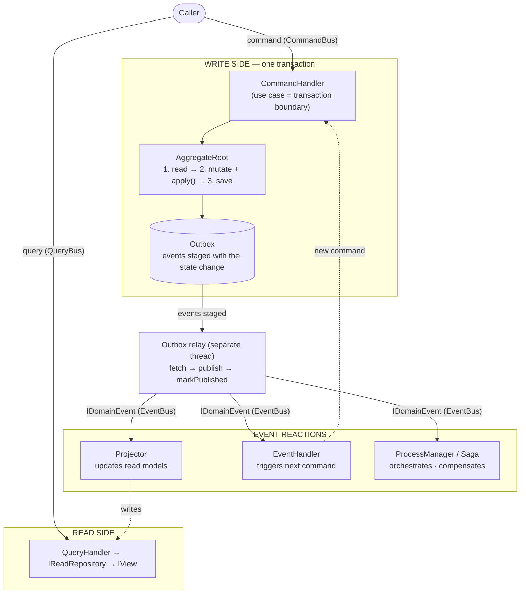
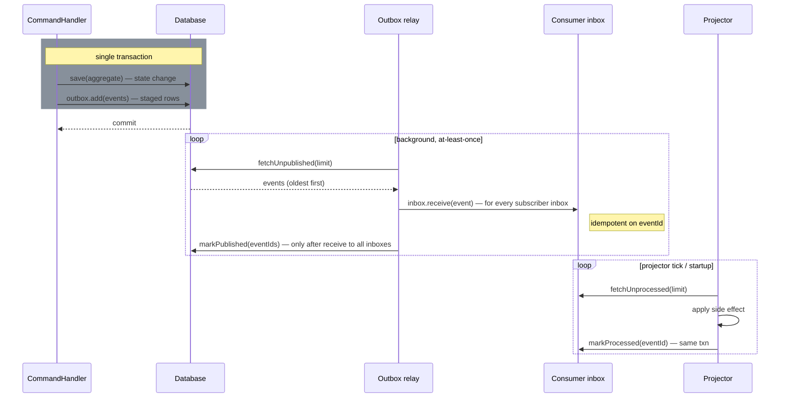

# app-bootstrap-core — Usage Guide

A lightweight Java framework that gives you the **building blocks** for Clean
Architecture, **CQRS** (Command Query Responsibility Segregation), and **DDD**
(Domain-Driven Design) tactical patterns — and nothing else.

> **Philosophy: contracts, not machinery.** This library ships interfaces and a
> few abstract base classes. It deliberately does **not** ship a concrete command
> bus, query bus, event bus, persistence layer, or transaction manager. You wire
> those to your infrastructure (Spring, Quarkus, plain Java, a database, a broker).
> The framework defines *the shape* of a correct CQRS/DDD application; you supply
> the runtime. The `src/test/java` tree contains small in-memory reference
> implementations (`SimpleICommandBus`, `SimpleQueryBus`, `InMemoryEventBus`,
> `InMemoryOutbox`, …) you can copy as a starting point.

---

## Table of contents

1. [Requirements & installation](#1-requirements--installation)
2. [Mental model: how the pieces fit](#2-mental-model-how-the-pieces-fit)
3. [Package map](#3-package-map)
4. [DDD building blocks (`app.bootstrap.core.ddd`)](#4-ddd-building-blocks-appbootstrapcoreddd)
5. [Messaging (`app.bootstrap.core.messaging`)](#5-messaging-appbootstrapcoremessaging)
6. [CQRS — the write side (`app.bootstrap.core.cqrs`)](#6-cqrs--the-write-side)
7. [CQRS — the read side](#7-cqrs--the-read-side)
8. [Reacting to events: projectors, event handlers, process managers](#8-reacting-to-events-projectors-event-handlers-process-managers)
9. [Command tracking](#9-command-tracking)
10. [The transaction boundary & the outbox](#10-the-transaction-boundary--the-outbox)
11. [Cross-cutting concerns (decorators)](#11-cross-cutting-concerns-decorators)
12. [End-to-end worked example](#12-end-to-end-worked-example)
13. [Building & testing](#13-building--testing)

---

## 1. Requirements & installation

- **Java 21+** (the project compiles with `maven.compiler.release=21`).
- **Maven 3.x**.
- The only runtime dependency is `jakarta.annotation-api` (for `@Nonnull` /
  `@Nullable`).

### Maven coordinates

The version is published to Maven Central — pick the latest.

```xml
<dependency>
    <groupId>io.github.n1ckl0sk0rtge</groupId>
    <artifactId>app-bootstrap-core</artifactId>
</dependency>
```

### Gradle

```kotlin
implementation("io.github.n1ckl0sk0rtge:app-bootstrap-core")
```

---

## 2. Mental model: how the pieces fit

The library encodes one opinionated flow. Read this once and the rest of the API
falls into place.



Key invariants the library is built around:

- **Commands change state and return (almost) nothing. Queries read state and
  never change it.** They travel on separate buses.
- **The command handler is the atomic transaction boundary.** The state write and
  the event hand-off must commit together (see [§10](#10-the-transaction-boundary--the-outbox)).
- **Aggregates are the consistency boundary.** You load one, change it, save it.
- **Read models are separate from aggregates** and are kept up to date by
  projectors reacting to domain events.

---

## 3. Package map

| Package | What lives there |
|---|---|
| `app.bootstrap.core.ddd` | Tactical DDD: `Id`, `Entity`, `AggregateRoot`, `DomainEvent`, `IRepository`, `ISpecification`, exceptions, `@BusinessRules`. |
| `app.bootstrap.core.messaging` | Transport-level eventing: `IEvent`, `IIntegrationEvent`, `ICorrelated`, `IEventBus`, `IEventListener`, `IOutbox`, `IInbox`. |
| `app.bootstrap.core.cqrs` | Commands, queries, their buses & handlers, the read side (read models, views, projections, repositories), projectors, process managers, command tracking, the `IUnitOfWork` transaction boundary. |

Naming convention: `IThing` is the contract (interface), `Thing` is an abstract
base class that captures common wiring (e.g. holds the injected bus/repository).

---

## 4. DDD building blocks (`app.bootstrap.core.ddd`)

### 4.1 `Id` — typed identifiers

A typed wrapper around a `UUID`. Subclass it once per aggregate/entity so IDs are
not interchangeable across types at compile time. Equality and `hashCode` are
based solely on the UUID and are `final`.

```java
public final class OrderId extends Id {
    public OrderId()           { super(UUID.randomUUID()); }   // new identity
    public OrderId(UUID uuid)  { super(uuid); }                 // rehydrate
}
```

> Note: equality compares the underlying UUID only, so two *different* `Id`
> subclasses sharing a UUID are considered equal / share a hash code. Don't mix id
> types in the same collection if that matters to you.

### 4.2 `Entity<T extends Id>` — identity equality

A domain object with a lifecycle and identity. Two entities are equal iff their
ids are equal.

```java
public class OrderLine extends Entity<OrderLineId> {
    private int quantity;
    public OrderLine(OrderLineId id, int quantity) { super(id); this.quantity = quantity; }
}
```

### 4.3 `IValueObject` — marker for value objects

A marker interface for immutable, attribute-compared values. Java `record`s are
the natural fit.

```java
public record Money(BigDecimal amount, Currency currency) implements IValueObject {}
```

### 4.4 `AggregateRoot<T extends Id>` — the consistency boundary

Extends `Entity` and adds **optimistic-concurrency versioning** and **uncommitted
domain-event tracking**.

Two constructors:

```java
protected AggregateRoot(T id);              // brand-new aggregate, version 0
protected AggregateRoot(T id, int version); // rehydrated from the store at `version`
```

This is a **state-stored** aggregate (not event-sourced): you store the current
state plus a version number. Events are recorded only to be *published*, not to
rebuild state.

Inside the aggregate you mutate fields and record what happened with the
protected `apply(event)`:

```java
public class Order extends AggregateRoot<OrderId> {
    private OrderStatus status;

    public Order(OrderId id) { super(id); this.status = OrderStatus.NEW; }
    public Order(OrderId id, int version, OrderStatus status) {
        super(id, version);          // rehydration ctor
        this.status = status;
    }

    public void confirm() {
        if (status != OrderStatus.NEW) {
            // throw a DomainException — see §4.8
        }
        this.status = OrderStatus.CONFIRMED;             // 1. change state
        apply(new OrderConfirmed(getId(), Order.class));  // 2. record the event
    }
}
```

Lifecycle / API:

| Method | Purpose |
|---|---|
| `getVersion()` | Current persisted version. |
| `getNextVersion()` | `version + 1` — what the next save should write. |
| `hasUncommitedChanges()` | Are there recorded-but-unpublished events? |
| `getUncommittedChanges()` | Unmodifiable list of recorded `IDomainEvent`s. |
| `apply(event)` | *(protected)* record a domain event. Call from mutating methods. |
| `markChangesAsCommitted()` | Bump version by 1 and clear events (when you publish elsewhere). |
| `commit(Consumer<List<IDomainEvent>>)` | Hand the events to a sink, then bump version and clear. |

**Versioning is per-save, not per-event.** Calling `confirm()` then `cancel()`
records two events but the version still advances by exactly **one** when you
commit/save. That models "one transaction = one new version."

The canonical save flow inside a command handler:

```java
repository.save(order);          // persist state at order.getNextVersion()
order.commit(outbox::add);       // publish/stage the recorded events, then bump+clear
```

`commit` accepts any sink: `outbox::add`, `domainEventBus::publish` per event, a
test collector, etc.

### 4.5 `IDomainEvent` & `DomainEvent`

`IDomainEvent extends IEvent` (so every domain event is a messaging event with an
`eventId` and `timestamp`). `DomainEvent` is a convenient abstract base that adds
the aggregate id, the aggregate type, and an optional event version:

```java
public final class OrderConfirmed extends DomainEvent {
    public OrderConfirmed(OrderId aggregateId, Class<? extends AggregateRoot<?>> type) {
        super(aggregateId, type);   // auto-generates eventId + timestamp
    }
}
```

Constructors let you either auto-generate `eventId`/`timestamp` (normal emission)
or pass them in (rehydrating an event from storage). You don't have to extend
`DomainEvent` — implementing `IDomainEvent` directly is fine (the tests do both).

**Deterministic timestamps via `Clock`.** The auto-generating constructors read the
wall clock. For tests that assert on `getTimestamp()`, there's a constructor overload
that takes a `java.time.Clock`; pass a `Clock.fixed(...)` to make the timestamp
deterministic. Production code uses the no-clock constructors, which default to
`Clock.systemUTC()`:

```java
// production — system clock
super(aggregateId, Order.class);
// test — frozen clock
super(aggregateId, Order.class, /*eventVersion*/ null, Clock.fixed(instant, ZoneOffset.UTC));
```

### 4.6 `IRepository<I, E>` & `Repository<I, E>`

The write-side repository contract for aggregates/entities:

```java
Optional<E> read(I id);
void        save(E entity);
void        delete(I id);
```

`Repository` is an abstract base that holds an injected `IDomainEventBus` for
implementations that publish on save. You implement the persistence yourself
(JPA, JDBC, in-memory, …):

```java
public final class JpaOrderRepository extends Repository<OrderId, Order> {
    public JpaOrderRepository(IDomainEventBus bus) { super(bus); }
    @Override public Optional<Order> read(OrderId id) { /* load + map */ }
    @Override public void save(Order order) { /* upsert at order.getNextVersion(),
                                                 enforce optimistic version */ }
    @Override public void delete(OrderId id) { /* ... */ }
}
```

#### Reconstructing an aggregate in `read`

`read` has to turn stored state back into an aggregate. Because the
`AggregateRoot(id, version)` constructor is `protected`, the **rehydration seam on
your aggregate must be `public`** — the concrete repository lives in the
infrastructure layer, in a different package from the domain aggregate, and Java
has no cross-package "friend" visibility. Package-private/`protected` won't reach
it. (Reflection or co-locating the repo with the aggregate would, but both break
the layering — don't.)

Prefer a **named static factory** over a second public constructor. A bare public
constructor reads like just another way to `new` the aggregate; a factory
advertises "this is the persistence-only door," and lets you keep the real
creation path (`Order.place(...)`) private:

```java
public final class Order extends AggregateRoot<OrderId> {

    public static Order place(...) { /* runs invariants, apply() events */ }

    private Order(OrderId id) { super(id); this.status = OrderStatus.NEW; }

    private Order(OrderId id, int version, OrderStatus status) {
        super(id, version);          // sets version, queues NO events
        this.status = status;
    }

    // PERSISTENCE SEAM — public, called only by the repository.
    public static Order reconstitute(OrderId id, int version, OrderStatus status) {
        return new Order(id, version, status);
    }
}
```

```java
@Override public Optional<Order> read(OrderId id) {
    return rows.findById(id.value())
               .map(r -> Order.reconstitute(new OrderId(r.id()), r.version(),
                                            OrderStatus.valueOf(r.status())));
}
```

Whichever form you pick (a public `reconstitute(...)` factory or a public
`(id, version, …fields)` constructor — the tests use the latter), the rules are
the same:

- it's `public` (forced by the domain↔infra split);
- it chains to `super(id, version)` so the version is set and **no uncommitted
  events are queued** — a freshly loaded aggregate must not re-publish history;
- it does **no** invariant validation and emits **no** `apply()` events — the
  stored state was already valid when it was written.

For aggregates with many fields, pass a single state/snapshot record instead of a
long parameter list, so the signature stays stable as the aggregate grows.

> **Query side:** don't reconstruct aggregates to answer queries. Use the read
> models in §7. Reconstruction via `read` is for the *write* side, where a command
> handler needs the aggregate's behavior and invariants to mutate it safely.

### 4.7 `ISpecification<T>` — composable business rules as predicates

A predicate you can compose with `and` / `or` / `not`.

```java
ISpecification<Product> inStock     = p -> p.isInStock();
ISpecification<Product> premium     = p -> p.getPrice() > 100.0;
ISpecification<Product> sellable    = inStock.and(premium.not());

if (sellable.isSatisfiedBy(product)) { /* ... */ }
```

Use them to keep selection/validation logic out of services and reusable across
the domain.

### 4.8 Exceptions: `DomainException`, `ApplicationException`, `AggregateVersionConflictException`

- **`DomainException`** (abstract, checked) — a broken *business* rule. Carries a
  `message`, a stable `errorCode`, and optional `context`.
- **`ApplicationException`** (abstract, checked) — an *application/use-case* level
  failure with the same shape. Keeps domain vs. application concerns separable.
- **`AggregateVersionConflictException`** — throw from a repository `save` when the
  persisted version is ahead of the version being written (optimistic-locking
  conflict).

```java
public final class OrderAlreadyConfirmed extends DomainException {
    public OrderAlreadyConfirmed(OrderId id) {
        super("Order " + id + " is already confirmed", "ORDER_ALREADY_CONFIRMED", id);
    }
}
```

### 4.9 `@BusinessRules` — documenting rules on code

A runtime-retained annotation for attaching rule identifiers to a type, field,
method, or parameter. Useful for traceability and for arch/lint tooling.

```java
@BusinessRules(rules = {"ORD-1: an order must have at least one line",
                        "ORD-2: confirmed orders are immutable"})
public class Order extends AggregateRoot<OrderId> { /* ... */ }
```

---

## 5. Messaging (`app.bootstrap.core.messaging`)

This package is the transport layer beneath domain events. It knows nothing about
DDD — it just moves `IEvent`s.

### 5.1 `IEvent`

The minimal event contract: a `UUID getEventId()` and `Instant getTimestamp()`.
`IDomainEvent` extends it, so domain events flow through the same machinery as
system/integration events.

### 5.2 `IEventBus` & `IEventListener`

A type-aware publish/subscribe contract:

```java
<E extends IEvent> void subscribe(Class<E> type, IEventListener<? super E> listener);
<E extends IEvent> void unsubscribe(Class<E> type, IEventListener<? super E> listener);
void subscribeAll(IEventListener<? super IEvent> listener);   // every event
void unsubscribeAll(IEventListener<? super IEvent> listener);
void publish(IEvent event);
```

`IEventListener<E>` is a single method: `void handleEvent(E event) throws Exception`.

You supply the implementation. The reference `InMemoryEventBus` (in tests)
dispatches synchronously to matching subscribers — copy and adapt it, or back the
bus with a real broker.

### 5.3 `IDomainEventBus` & `IDomainEventListener`

Domain-flavored specializations: `IDomainEventBus extends IEventBus` and adds
`subscribe/unsubscribe(IDomainEventListener)` and `publish(IDomainEvent)`.
`IDomainEventListener extends IEventListener<IDomainEvent>`. Inject this into
repositories, projectors, and event handlers.

### 5.4 `IOutbox` — reliable event delivery (transactional outbox)

The single most important infrastructure contract. It removes the **dual-write
problem**: if you commit a state change to the DB and *then* publish to a broker,
a crash in between loses the event forever and downstream state drifts.

The outbox fixes this by staging events as **rows in the same database,
written in the same transaction** as the state change. A separate relay then
publishes them with **at-least-once** delivery.



```java
public interface IOutbox {
    void           add(List<? extends IEvent> events);   // stage (in the write txn)
    List<IEvent>   fetchUnpublished(int limit);          // oldest first
    void           markPublished(List<UUID> eventIds);   // ack
}
```

Write side (inside the transaction):

```java
repository.save(aggregate);
aggregate.commit(outbox::add);   // List<IDomainEvent> fits List<? extends IEvent>
```

Relay (separate thread/process). The contract is unchanged; the one behavioral note
is *when* `markPublished` is called — after `receive` has committed to **every**
subscriber inbox, not after a bus publish (see §5.5):

```java
List<IEvent> batch = outbox.fetchUnpublished(100);
batch.forEach(event -> subscriberInboxes.forEach(inbox -> inbox.receive(event)));
outbox.markPublished(batch.stream().map(IEvent::getEventId).toList());
```

**Because delivery is at-least-once, consumers must be idempotent** — `receive` is
idempotent on `IEvent.getEventId()`. Events come back oldest-first to preserve
staging order. The reference `InMemoryOutbox` (in tests) models the
delete-after-publish strategy; a real one is a DB table plus a polling/CDC relay.

### 5.5 `IInbox` — the durable mailbox (the other half of at-least-once)

The outbox makes the **producer** reliable; `IInbox` makes the **consumer**
reliable. It is a **per-consumer durable mailbox**, not just a dedup set: every
event the consumer receives is staged durably and tracked through a
**received → processed** lifecycle, so the inbox is itself the consumer's replay
source. A projector that restarts asks its inbox "what did I receive but not yet
apply?" and resumes — and because redeliveries are idempotent on `eventId`, applying
the same event twice still happens once.

Fault tolerance hands off from the outbox to the inbox at delivery time: the outbox
only has to survive until the event is durably in **every** subscriber's inbox; from
there each inbox is its own durable replay source.

```java
public interface IInbox {
    void           receive(IEvent event);     // relay side: stage incoming, idempotent on eventId
    List<IEvent>   fetchUnprocessed(int n);   // consumer side: received-but-unprocessed, oldest-first
    boolean        alreadyProcessed(UUID id); // consumer side: received AND processed?
    void           markProcessed(UUID id);    // consumer side: flip processed=true (same txn as side effect)
}
```

Two ends. The **relay** stages incoming events; the **consumer** drains them on each
tick and on startup:

```java
// relay: once receive() has committed to every subscriber inbox, the outbox may drop the event
inbox.receive(event);

// consumer tick / startup recovery — drain received-but-unprocessed, oldest first
for (IEvent event : inbox.fetchUnprocessed(100)) {
    if (inbox.alreadyProcessed(event.getEventId())) {
        continue;                             // a concurrent drain already applied it — skip
    }
    applyTheSideEffect(event);                // update a read model, call a collaborator…
    inbox.markProcessed(event.getEventId());  // same transaction as the side effect
}
```

**`markProcessed` must commit in the same transaction as the side effect it
guards.** If the side effect commits but the mark is lost, the event stays
unprocessed and the next drain runs it again; if the mark commits but the side effect
is lost, the event is dropped. When the side effect isn't transactional (a remote
call), make that call idempotent too — at-least-once still holds, exactly-once does
not.

**`markProcessed` flips a flag — it does not delete the row.** The processed row must
survive as a tombstone until the matching outbox row is gone. A fan-out redelivery
(the outbox still holds the event because a *sibling* inbox hadn't acked `receive`
yet) would otherwise re-insert the event via `receive()` and the projector would
double-apply. Keep the row; a retention reaper prunes processed rows older than a
window that exceeds the maximum outbox redelivery lag.

A durable implementation is one table per consumer keyed by `eventId` (the insert
*is* the idempotency, via the primary-key constraint) with a `BIGSERIAL`
receive-sequence for `fetchUnprocessed` ordering and a `processed` flag. The
reference `InMemoryInbox` (in tests) is a `Map<UUID, Entry>` of `{event, seq,
processed}` rows.

### 5.6 `IIntegrationEvent` — events that cross a boundary

`IDomainEvent` is an **internal** record of something that happened inside one
aggregate; its shape is coupled to your domain model and free to change.
`IIntegrationEvent` is the opposite by intent: a **public, cross-boundary**
message — stable and intentionally shaped — that you publish for other bounded
contexts or external systems.

```java
public record OrderPlacedIntegrationEvent(
        UUID getEventId, Instant getTimestamp, String orderId, String customerId, long totalCents)
    implements IIntegrationEvent {}
```

Don't forward domain events across a boundary — that couples every outside consumer
to your internal model. **Translate** instead: a listener reacts to one or more
domain events and emits a separate integration event carrying only the fields the
outside world needs. Both are `IEvent`s and ride the same outbox/bus; the marker
just makes the boundary explicit in the type system (and checkable by arch rules).

### 5.7 `ICorrelated` — tracing a flow's lineage

A single user action fans out into a chain — a command produces events, an event
triggers a follow-up command, a process manager emits more. `ICorrelated` is an
**opt-in** mixin that lets a message carry the two ids that reconstruct that chain:

```java
public interface ICorrelated {
    @Nullable UUID getCorrelationId();   // constant across the whole end-to-end flow
    @Nullable UUID getCausationId();      // the immediate parent message's id
}
```

- **Correlation id** — stamped once on the first message and copied unchanged onto
  everything descended from it, so "everything that happened because of this request"
  is one lookup.
- **Causation id** — the id of the *immediate* parent, reconstructing the precise
  edges of the causality tree.

Deriving a child `c` from a parent `p`: `c.correlationId = p.correlationId` and
`c.causationId = p`'s own id. A **root** message has `causationId == null` and, by
convention, `correlationId == ` its own id. Both accessors are nullable, so a
message that was never enriched is representable. It's a small optional interface
rather than a field on `IEvent`/`ICommand` on purpose — implement it only on the
messages whose lineage you want to track (it pairs naturally with command tracking in
§9 and the process managers / sagas in §8.3).

---

## 6. CQRS — the write side

### 6.1 Fire-and-forget commands

A command is an intention to change state. Mark it with `ICommand` (typically a
`record`):

```java
public record ConfirmOrder(OrderId orderId) implements ICommand {}
```

A handler implements `ICommandHandler` (`void handle(ICommand) throws Exception`).
For the common "load → mutate → save" use case, extend the abstract
`CommandHandler<I, E>`, which injects the command bus and the aggregate repository:

```java
public final class ConfirmOrderHandler extends CommandHandler<OrderId, Order> {
    private final IOutbox outbox;

    public ConfirmOrderHandler(ICommandBus bus, IRepository<OrderId, Order> repo, IOutbox outbox) {
        super(bus, repo);
        this.outbox = outbox;
    }

    @Override
    public void handle(ICommand command) throws Exception {
        var cmd   = (ConfirmOrder) command;
        var order = repository.read(cmd.orderId())
                              .orElseThrow(() -> new OrderNotFound(cmd.orderId()));
        order.confirm();                 // mutate + apply() events
        repository.save(order);          // persist state    ┐ one
        order.commit(outbox::add);       // stage events     ┘ transaction
    }
}
```

> The whole `handle` body must run in **one transaction** — see [§10](#10-the-transaction-boundary--the-outbox).

### 6.2 The command bus — `ICommandBus`

Register handlers and dispatch commands (sync or async):

```java
void register(ICommandHandler handler, Class<? extends ICommand> forCommand);
void register(ICommandHandler handler, List<Class<? extends ICommand>> forCommands);
void unregister(...);                                  // mirror of register

CompletableFuture<Boolean> send(ICommand command);     // async; false if no handler
Boolean                    sendSync(ICommand command); // sync
```

Wiring & dispatch:

```java
ICommandBus bus = new SimpleICommandBus();      // your impl (reference in tests)
bus.register(new ConfirmOrderHandler(bus, repo, outbox), ConfirmOrder.class);

bus.sendSync(new ConfirmOrder(orderId));        // blocks, runs handler in caller thread
bus.send(new ConfirmOrder(orderId));            // returns immediately
```

**A command type may have multiple handlers** — they run as *additive* fan-out
(e.g. one writes, another audits). Independent handlers can't wrap each other,
guarantee ordering, or stop a sibling. Anything that must run *around* a handler
(validation that rejects, an enclosing transaction, retries) belongs in a
**decorator**, not a second handler — see [§11](#11-cross-cutting-concerns-decorators).

### 6.3 Result commands — `IResultCommand<R>`

Most commands should return nothing (or just an `Id`). When a command genuinely
must return a value, use the typed result flavor. Unlike fire-and-forget commands,
a result command has **exactly one** handler.

```java
public record RegisterUser(String email) implements IResultCommand<UserId> {}

public final class RegisterUserHandler
        implements IResultCommandHandler<RegisterUser, UserId> {
    @Override public UserId handle(RegisterUser cmd) throws Exception {
        var user = new User(new UserId(), cmd.email());
        // save + commit events…
        return user.getId();
    }
}
```

Register and send through the same bus:

```java
bus.register(new RegisterUserHandler(), RegisterUser.class);
UserId id = bus.sendSync(new RegisterUser("a@b.com"));          // typed result
CompletableFuture<UserId> f = bus.send(new RegisterUser("a@b.com"));
```

#### `@AllowedResultType` — opt out of the "commands return identifiers" rule

By convention (enforceable with an arch rule called *G4c*), a command result must
be `Void`, a primitive wrapper, or an `Id` subtype. When you have a justified
reason to return a DTO, annotate the command and **state why** — the rationale
travels with the code:

```java
@AllowedResultType(reason = "Bulk import returns a per-row outcome report the caller must inspect")
public record ImportUsers(List<Row> rows) implements IResultCommand<ImportReport> {}
```

### 6.4 Queries — `IQuery<R>`, `IQueryHandler<Q,R>`, `IQueryBus`

Queries read state and never mutate it. They are strongly typed by result.

```java
public record GetUserById(String id) implements IQuery<UserView> {}      // returns a view

public final class GetUserByIdHandler
        extends QueryHandler<GetUserById, UserView> {            // QueryHandler injects the bus
    private final IReadRepository<String> repo;                  // read port — no entity type
    public GetUserByIdHandler(IQueryBus bus, IReadRepository<String> repo) {
        super(bus); this.repo = repo;
    }
    @Override public UserView handle(GetUserById q) throws Exception {
        return repo.read(q.id(), UserView.class).orElseThrow(() -> new UserNotFound(q.id()));
    }
}
```

The bus has **one handler per query type**:

```java
<Q extends IQuery<R>, R> void register(IQueryHandler<Q,R> handler, Class<? extends IQuery<R>> forQuery);
<R> void remove(Class<? extends IQuery<R>> forQuery);
<R> CompletableFuture<R> send(IQuery<R> query);     // async
<R> R                    sendSync(IQuery<R> query); // sync
```

```java
IQueryBus qbus = new SimpleQueryBus();      // your impl (reference in tests)
qbus.register(new GetUserByIdHandler(qbus, readRepo), GetUserById.class);
UserView u = qbus.sendSync(new GetUserById("u-1"));
```

Cross-cutting concerns on queries (caching, timing, authorization) are added by
**decorating `IQueryBus`** — there's no fan-out to abuse.

---

## 7. CQRS — the read side

Read models are **separate** from aggregates and shaped for querying. They live
behind their own repository and are updated by projectors ([§8](#8-reacting-to-events-projectors-event-handlers-process-managers)).

One logical read model fans out: **many projectors** can maintain it (each owning a
disjoint set of fields) and **many views** can materialize different parts of it for
queries. The read-side ports are keyed by **id only** — they never name the read-model
*persistence entity* — so a use-case-layer query handler or projector can depend on
them without referencing infrastructure (no `usecases → infrastructure` import). The
entity stays behind the repository implementation, which maps it to/from the
use-case-owned view / projection DTOs.

### 7.1 `IView`, `IProjection` (and the optional `IReadModel<I>` marker)

```java
// READ slices — what queries return. Keyed by id; each is a different part of the
// same logical read model. One read model can have as many views as callers need.
public record UserView(String getId, String name, String email, int age)
        implements IView<String> {}                 // the widest "everything" view
public record UserContactView(String getId, String email)
        implements IView<String> {}                 // a narrow slice

// WRITE slices — carry only the fields to update; upsert merges them. Different
// projectors own different projections of the same read model.
public record UserNameProjection(String getId, String name)
        implements IProjection<String> {}
public record UserAgeProjection(String getId, int age)
        implements IProjection<String> {}
```

- **`IView<I>`** — a *read* slice a query returns; lets callers fetch a few fields
  cheaply. A use-case-owned DTO, **never** the persistence entity.
- **`IProjection<I>`** — a *write* slice; carries id + changed fields so a projector
  can update part of a read model without loading it first. Also use-case-owned.
- **`IReadModel<I>`** — an *optional* marker for the full logical record. It is **not**
  a type parameter on any port (that's what kept the entity from leaking). Implement it
  on the widest view or on your persistence entity only if a single named handle is
  useful; it carries nothing beyond `getId()`.

### 7.2 `IReadRepository<I>` (read), `IProjectionStore<I>` & `IDeletableProjectionStore<I>` (write)

The ports are split by side and keyed by id only — no `R`:

```java
// Query side — used by query handlers.
<V extends IView<I>> Optional<V> read(I id, Class<V> v);   // materialize a view (IReadRepository)

// Write side — used by projectors.
void upsert(IProjection<I> projection);                    // field-scoped merge (IProjectionStore)
void delete(I id);                                         // whole-row remove (IDeletableProjectionStore)
```

#### Who owns deletion? Field ownership is shared; existence is single-owned

`upsert` is **field-scoped, additive, and commutative**, which is exactly why it can be
distributed across many projectors (§8.1) that each own a disjoint set of columns. Deletion is
none of those things — it's a **whole-row, destructive, non-commutative** operation — so it
*cannot* be distributed the same way and is split onto a separate port:

- **`IProjectionStore<I>`** — `upsert` only. Every field-contributing projector depends on this.
- **`IDeletableProjectionStore<I> extends IProjectionStore<I>`** — adds `delete(id)`. Only the
  read model's single **lifecycle owner** depends on it.

The **lifecycle owner** is the one projector that reacts to the source aggregate's *existence*
events: `UserRegistered` → the first `upsert` (which inserts the row), `UserDeleted` → `delete`.
Every other projector only fills in field slices *between* those two boundaries and can never
delete. This mirrors the write side, where one aggregate is the consistency boundary for its own
lifecycle. Splitting the capability onto its own interface makes "this projector owns the row's
existence" visible in the type system — and means append-only read models (audit/event logs) or
stores whose lifecycle is owned elsewhere are no longer forced to implement a `delete` they have
no business offering.

Two traps the type split doesn't solve for you:

- **Composite read models.** `delete(id)` is sound only when *one* aggregate's existence equals
  the row's existence. If a read model is assembled from several aggregates (name from `User`,
  balance from `Account`), there is no single lifecycle — "the user went away" should null out the
  user-owned slice with another `upsert`, **not** `delete` the whole row, which would destroy
  fields still owned by a living `Account`.
- **Resurrection under at-least-once delivery.** A field `upsert` can arrive *after* the `delete`
  and re-create the row. Make `delete` idempotent and, where ordering can invert, tombstone the id
  so a late bare `upsert` doesn't re-insert — the same concern as the inbox tombstone in §5.5.

An adapter typically realises **both** read and write ports (and `IDeletableProjectionStore` when
its read model has a lifecycle owner). It belongs in (or is wired from)
infrastructure — that's where the persistence entity is mapped to/from the
use-case-owned view / projection DTOs, so the entity never crosses the layer boundary.
You implement storage (a SQL view table, Elasticsearch, a cache, …). A minimal
in-memory example — `Row` is the adapter's private persistence shape, never a port type:

```java
public final class InMemoryUserReadRepository                       // the lifecycle owner's store
        implements IReadRepository<String>, IDeletableProjectionStore<String> {
    private record Row(String id, String name, String email, int age) {}
    private final Map<String, Row> store = new ConcurrentHashMap<>();

    @Override public <V extends IView<String>> Optional<V> read(String id, Class<V> view) {
        return Optional.ofNullable(store.get(id)).map(row -> view.cast(project(row, view)));
    }
    @Override public void upsert(IProjection<String> p) {
        store.compute(p.getId(), (id, current) -> apply(current, p)); // overlay only p's fields
    }
    @Override public void delete(String id) { store.remove(id); }
    // project(row, view) and apply(current, projection) are your mapping logic
}
```

> Creation happens through `upsert` too: the first projection for an id (one carrying
> all required fields) inserts the row; later projections merge their fields in. There
> is no separate `save(entity)` — that's deliberate, since it would force the entity
> into the port signature.

> **Concurrency: implement `upsert` as a field-scoped write, not a whole-row merge.**
> This matters precisely *because* many projectors maintain one read model. The
> signature carries a *partial* slice (`IProjection`) on purpose: an `upsert` should
> touch **only the columns the projection carries**. The in-memory example above takes
> the read-modify-write shortcut (`apply` rebuilds the whole `Row`, then `compute` puts
> it back) — atomic-per-key for a `ConcurrentHashMap` demo, but mapped naively onto a
> real store it reintroduces the whole row on every write. When two projectors update
> *different* fields of the same row concurrently, that whole-row rewrite races: the
> slower writer's merge is based on a stale snapshot and silently reverts the other
> field — a classic **lost update**. The window is often self-healing (the next
> propagation re-writes the correct value), but it is still a visible-state bug.
>
> Two structural fixes, both implemented in *your* repository (the library is
> persistence-agnostic and prescribes neither):
> - **Targeted column `UPDATE`** — translate each projection into
>   `UPDATE … SET <only its fields> WHERE id = ?`, never a full-entity `merge()`/replace.
>   Disjoint-field writers then can't clobber each other. This is the preferred default.
> - **`@Version` optimistic lock** — add a version column to the read row and retry on
>   conflict. Use this when writers genuinely contend on the *same* field. Note the read
>   side has no built-in version (`IView`/`IProjection` carry only `getId()`, by design); this is
>   distinct from the aggregate-level versioning in
>   [§4.4](#44-aggregateroott-extends-id--the-consistency-boundary) and lives entirely
>   in your read entity.

---

## 8. Reacting to events: projectors, event handlers, process managers

All three react to events; what differs is their job. Both `IProjector<E extends IEvent>`
and `IEventHandler<E extends IEvent>` are parameterized over the event type they consume
and build on `IEventListener<E>`: use `E = IEvent` for any event, or narrow it (the base
`DomainEventHandler` binds `E` to `IDomainEvent`). Subscribe a listener with
`subscribeAll(this)` (requires `E = IEvent`) or `subscribe(SomeEvent.class, this)`.

### 8.1 `IProjector<E>` / `Projector<I,E>` — keep read models in sync

A projector listens for events and upserts projection slices. It's the bridge from the
write side to the read side, and it depends only on the **write port**
(`IProjectionStore<I>`) — never on the persistence entity. `IProjector<E extends IEvent>`
is parameterized by the event type it consumes: use `E = IEvent` to handle any event and
subscribe with `subscribeAll(this)`, or narrow `E` (e.g. `IDomainEvent` or a specific
event) and subscribe with `subscribe(SomeEvent.class, this)`.

```java
public final class UserProjector extends Projector<String, IEvent> {
    public UserProjector(IDomainEventBus bus, IProjectionStore<String> store) {
        super(bus, store);
        bus.subscribeAll(this);                     // start listening (any IEvent)
    }
    @Override public void handleEvent(IEvent event) throws Exception {
        if (event instanceof UserRegistered e) {   // first upsert creates the row
            store.upsert(new UserRegisteredProjection(
                    e.getAggregateId().toString(), e.name(), e.email(), 0));
        } else if (event instanceof UserRenamed e) {
            store.upsert(new UserNameProjection(e.getAggregateId().toString(), e.newName()));
        }
    }
}
```

`Projector` injects the `IDomainEventBus` and the `IProjectionStore`. Because the store
is keyed by id only, **several projectors can maintain one read model** — e.g. a
separate `UserActivityProjector` upserting a `UserLastSeenProjection` — each owning a
disjoint set of fields without stepping on the others.

### 8.2 `IEventHandler` / `DomainEventHandler` — trigger follow-up work

When reacting to an event means *issuing another command* (rather than updating a
read model), extend `DomainEventHandler`, which injects the command bus and the
domain event bus.

```java
public final class SendWelcomeEmailHandler extends DomainEventHandler {
    public SendWelcomeEmailHandler(ICommandBus cmd, IDomainEventBus events) {
        super(cmd, events);
        events.subscribe(this);
    }
    @Override public void handleEvent(IDomainEvent event) throws Exception {
        if (event instanceof UserRegistered e) {
            commandBus.send(new SendEmail(e.email(), "Welcome!"));
        }
    }
}
```

### 8.3 `ISaga` / `ProcessManager` — long-running orchestration & compensation

A process manager coordinates a multi-step flow across aggregates and knows how to
**compensate** (undo) when a later step fails — the saga pattern for distributed
consistency without 2PC.

`ProcessManager<I,E>` extends `CommandHandler<I,E>` (so it can load/save its own
state aggregate and send commands) **and** implements `ISaga<I>`:

```java
public interface ISaga<I extends Id> {
    void compensate(I id) throws Exception;   // undo the steps done so far
}
```

```java
public final class OrderFulfillmentProcess
        extends ProcessManager<SagaId, FulfillmentState> {
    public OrderFulfillmentProcess(ICommandBus bus, IRepository<SagaId, FulfillmentState> repo) {
        super(bus, repo);
    }
    @Override public void handle(ICommand command) throws Exception {
        // advance the process: reserve stock → charge payment → ship …
        // each step issues a command via commandBus and records progress
    }
    @Override public void compensate(SagaId id) throws Exception {
        // a step failed: release stock, refund payment, etc.
    }
}
```

---

## 9. Command tracking

For commands whose lifecycle you want to observe (async pipelines, dashboards,
retries), opt in with the tracking contracts.

- **`ITrackableCommand`** — a command *as sent*: `UUID id()`, `Class<…> type()`,
  `Map<String,String> metadata()`. No status (a just-sent command has none yet).
- **`ITrackedCommand`** — a *stored snapshot*: extends `ITrackableCommand` and adds
  `CommandStatus status()` plus `isTerminal()`.
- **`CommandStatus`** — `PENDING`, `PROCESSING`, `COMPLETED`, `FAILED`, `UNKNOWN`
  (the last three are terminal).
- **`ICommandTrackingRepository`** — `update(trackable, status)` and
  `List<ITrackedCommand> fetch()`.

```java
public record ImportBatch(UUID id, String file) implements ITrackableCommand {
    @Override public UUID id() { return id; }
    @Override public Class<? extends ITrackableCommand> type() { return ImportBatch.class; }
    @Override public Map<String,String> metadata() { return Map.of("file", file); }
}
```

A command-bus implementation that's aware of `ITrackableCommand` records a snapshot
via the repository as the command moves `PENDING → PROCESSING → COMPLETED/FAILED`.
You provide both the bus behavior and the repository storage.

---

## 10. The transaction boundary & the outbox

This is the rule that makes the whole thing reliable, so it gets its own section.

**The `CommandHandler.handle` body is the atomic transaction boundary.** The state
write and the event hand-off must commit **together**:

```java
repository.save(aggregate);    // state change
aggregate.commit(outbox::add); // events staged as rows in the SAME transaction
```

If `save` and `outbox.add` land in *different* transactions, the dual-write
problem is back: a crash between them persists the state but loses the events, and
downstream read models / integrations drift permanently.

**The library does not manage transactions** — it has no persistence dependency.
You own the boundary with your infrastructure, typically one of:

- a declarative `@Transactional` on the handler's `handle` method (Spring),
- an explicit programmatic transaction in the persistence adapter,
- or your framework's equivalent unit-of-work.

Then a **separate relay** drains the outbox and publishes to the event bus with
at-least-once delivery; idempotent consumers dedupe on `eventId`
(see [§5.4](#54-ioutbox--reliable-event-delivery-transactional-outbox)).

---

## 11. Cross-cutting concerns (decorators)

The library ships **no pipeline/middleware type** on purpose. Concerns that must
run *around* dispatch — validation, authorization, an enclosing transaction,
retries, timing, caching — are added by **decorating the bus interface**: write a
class that `implements ICommandBus` (or `IQueryBus`), wraps a delegate, applies
the concern, and forwards the call. Decorators stack.

```java
public final class TimingCommandBus implements ICommandBus {
    private final ICommandBus delegate;
    public TimingCommandBus(ICommandBus delegate) { this.delegate = delegate; }

    @Override public Boolean sendSync(ICommand command) throws Exception {
        long t0 = System.nanoTime();
        try { return delegate.sendSync(command); }
        finally { log.info("{} took {}ms", command.getClass().getSimpleName(),
                           (System.nanoTime() - t0) / 1_000_000); }
    }
    // … forward every other ICommandBus method to `delegate` …
}

ICommandBus bus = new TimingCommandBus(new ValidatingCommandBus(new SimpleICommandBus()));
```

Do **not** model "around" behavior as a second command handler — fan-out handlers
are independent and additive, and can't reject or wrap one another.

### 11.1 The transaction as a decorator — `IUnitOfWork`

The single most important "around" concern is the **transaction boundary** from
[§10](#10-the-transaction-boundary--the-outbox). Rather than rely on every handler
remembering `@Transactional`, you can make *every* command atomic in one place by
decorating the bus with a unit of work.

`IUnitOfWork` (in `app.bootstrap.core.cqrs`) is that boundary expressed as a type:

```java
public interface IUnitOfWork {
    <R> R execute(Callable<R> work) throws Exception;   // commit on return, roll back on throw
}
```

`execute` runs the work, **commits if it returns normally, rolls back and rethrows
if it throws**. It's the seam a command handler's `save` + `outbox.add` (and a
second aggregate, and a command-tracking transition) all run inside, so they commit
together or not at all — the cross-aggregate "one unit of work" case from earlier.

A `TransactionalCommandBus` decorator wraps every synchronous dispatch in it:

```java
public final class TransactionalCommandBus implements ICommandBus {
    private final ICommandBus delegate;
    private final IUnitOfWork unitOfWork;
    // ctor …

    @Override public Boolean sendSync(ICommand command) throws Exception {
        return unitOfWork.execute(() -> delegate.sendSync(command));
    }
    @Override public <R> R sendSync(IResultCommand<R> command) throws Exception {
        return unitOfWork.execute(() -> delegate.sendSync(command));
    }
    // async send(...) is forwarded unchanged; registration forwards to delegate …
}

ICommandBus bus = new TransactionalCommandBus(new SimpleICommandBus(), unitOfWork);
```

Two things to know:

- **Async `send` is *not* wrapped.** A unit of work is thread-bound, and async
  dispatch runs the handler on a worker thread — so the transaction must be opened
  *there* (in the bus impl or handler), not on the enqueuing thread the decorator
  sees. The decorator wraps `sendSync` and forwards `send`.
- **Rollback needs the failure to propagate.** The typed `sendSync(IResultCommand)`
  path rethrows handler exceptions, so a throw rolls the unit of work back. A bus
  that *swallows* fire-and-forget handler exceptions (as the reference
  `SimpleICommandBus` does) returns normally and commits — let handlers whose
  atomicity matters throw.

The library ships **no implementation** of `IUnitOfWork`: a real one delegates to
your infrastructure — a JPA `EntityManager` (itself a unit of work), a Spring
`TransactionTemplate` / `@Transactional`, or JTA. It's framework-agnostic so the
application layer depends on the *boundary*, not the transaction manager. The
reference `InMemoryUnitOfWork` (in tests) models commit/rollback in memory.

### 11.2 Queries don't need a unit of work

Queries don't mutate, so there's nothing to commit or roll back — a `IUnitOfWork`
is the wrong tool for the read side. The most a query side wants is a **read-only
transaction** for snapshot consistency when one query reads several read models, and
that too is just a decorator on `IQueryBus`:

```java
public final class ReadOnlyTxQueryBus implements IQueryBus {
    private final IQueryBus delegate;
    private final TransactionRunner tx;            // your infra: opens a read-only txn
    // ctor …
    @Override public <R> R sendSync(IQuery<R> query) throws Exception {
        return tx.readOnly(() -> delegate.sendSync(query));
    }
    // … forward the rest …
}
```

Most query handlers need none of this; reach for it only when cross-read
consistency actually matters.

---

## 12. End-to-end worked example

A complete "register a user" slice, wiring write side → outbox → projector → read
side → query. (Infrastructure types like `SimpleICommandBus` are the in-memory
references from `src/test/java`.)

```java
// ---- Domain ----------------------------------------------------------------
final class UserId extends Id {
    UserId()         { super(UUID.randomUUID()); }
    UserId(UUID u)   { super(u); }
}

final class UserRegistered extends DomainEvent {
    private final String email;
    UserRegistered(UserId id, String email) { super(id, User.class); this.email = email; }
    String email() { return email; }
}

final class User extends AggregateRoot<UserId> {
    private String email;
    User(UserId id) { super(id); }                          // new
    User(UserId id, int version, String email) {            // rehydrate
        super(id, version); this.email = email;
    }
    static User register(String email) {
        var u = new User(new UserId());
        u.email = email;
        u.apply(new UserRegistered(u.getId(), email));      // record event
        return u;
    }
    String email() { return email; }
}

// ---- Command + handler (write side) ---------------------------------------
record RegisterUser(String email) implements IResultCommand<UserId> {}

final class RegisterUserHandler implements IResultCommandHandler<RegisterUser, UserId> {
    private final IRepository<UserId, User> repo;
    private final IOutbox outbox;
    RegisterUserHandler(IRepository<UserId, User> repo, IOutbox outbox) {
        this.repo = repo; this.outbox = outbox;
    }
    @Override public UserId handle(RegisterUser cmd) throws Exception {
        var user = User.register(cmd.email());
        repo.save(user);             // ┐ one transaction (your @Transactional / UoW)
        user.commit(outbox::add);    // ┘ stage events with the state change
        return user.getId();
    }
}

// ---- Read side -------------------------------------------------------------
record UserView(String getId, String email) implements IView<String> {}         // read slice
record UserProjection(String getId, String email) implements IProjection<String> {} // write slice
record GetUser(String id) implements IQuery<UserView> {}

final class GetUserHandler implements IQueryHandler<GetUser, UserView> {
    private final IReadRepository<String> repo;                 // read port — no entity type
    GetUserHandler(IReadRepository<String> repo) { this.repo = repo; }
    @Override public UserView handle(GetUser q) throws Exception {
        return repo.read(q.id(), UserView.class).orElseThrow();
    }
}

final class UserProjector extends Projector<String, IEvent> {
    UserProjector(IDomainEventBus bus, IProjectionStore<String> store) {         // write port
        super(bus, store); bus.subscribeAll(this);
    }
    @Override public void handleEvent(IEvent e) {
        if (e instanceof UserRegistered ev) {
            store.upsert(new UserProjection(ev.getAggregateId().toString(), ev.email()));
        }
    }
}

// ---- Wiring & run ----------------------------------------------------------
var commandBus = new SimpleICommandBus();
var queryBus   = new SimpleQueryBus();
var eventBus   = new InMemoryEventBus();         // implements IDomainEventBus in your code
var outbox     = new InMemoryOutbox();

var writeRepo  = new InMemoryUserRepository();   // IRepository<UserId, User>
var readRepo   = new InMemoryUserReadRepository();

new UserProjector(eventBus, readRepo);           // subscribes itself
commandBus.register(new RegisterUserHandler(writeRepo, outbox), RegisterUser.class);
queryBus.register(new GetUserHandler(readRepo), GetUser.class);

// 1. write
UserId id = commandBus.sendSync(new RegisterUser("ada@example.com"));

// 2. relay drains the outbox to the event bus (normally a background thread)
var batch = outbox.fetchUnpublished(100);
batch.forEach(eventBus::publish);                // UserProjector updates the read model
outbox.markPublished(batch.stream().map(IEvent::getEventId).toList());

// 3. read
UserView view = queryBus.sendSync(new GetUser(id.toString()));
```

---

## 13. Building & testing

```bash
./mvnw clean verify      # compile, run tests, format check, static analysis
./mvnw test              # tests only
```

The build enforces quality gates you'll want to respect when extending the code:

- **Spotless** with Google-Java-Format (AOSP style) — runs `apply` in the
  `validate` phase, and enforces the Apache-2.0 license header on every file.
- **Checkstyle** — import hygiene, `final` classes, `@Override`, etc.
- **Error Prone + NullAway** — null-safety static analysis. Honor the
  `@Nonnull`/`@Nullable` annotations the API uses throughout.

The `src/test/java` tree doubles as **living documentation**: `SimpleICommandBus`,
`SimpleQueryBus`, `InMemoryEventBus`, `InMemoryOutbox`,
`InMemoryCommandTrackingRepository`, and the `ReadRepositoryTest` repository are
all minimal reference implementations of the contracts above. Start from them.

---

## Quick reference: interface → what you implement

| You want to… | Implement / extend | Provided by you or the library? |
|---|---|---|
| Identify an aggregate/entity | `Id` (subclass) | you |
| Model a value | `IValueObject` (record) | you |
| Model an aggregate | `AggregateRoot<Id>` | you (base from lib) |
| Emit a domain event | `DomainEvent` / `IDomainEvent` | you (base from lib) |
| Persist aggregates | `IRepository` / `Repository` | you implement storage |
| Express a rule | `ISpecification` | you |
| Define a command | `ICommand` / `IResultCommand<R>` (record) | you |
| Handle a command | `ICommandHandler` / `CommandHandler` / `IResultCommandHandler` | you |
| Dispatch commands | `ICommandBus` | **you implement** (reference in tests) |
| Define / handle a query | `IQuery<R>` / `IQueryHandler` / `QueryHandler` | you |
| Dispatch queries | `IQueryBus` | **you implement** (reference in tests) |
| Shape read data | `IView` / `IProjection` (+ optional `IReadModel` marker) | you |
| Read data (query side) | `IReadRepository` | you implement storage |
| Write read models (write side) | `IProjectionStore` (+ `IDeletableProjectionStore` for the lifecycle owner) | you implement storage |
| Update read models from events | `IProjector` / `Projector` | you |
| Trigger follow-up commands from events | `IEventHandler` / `DomainEventHandler` | you |
| Orchestrate multi-step flows | `ISaga` / `ProcessManager` | you |
| Move events between components | `IEventBus` / `IDomainEventBus` | **you implement** (reference in tests) |
| Deliver events reliably (producer) | `IOutbox` | **you implement** (reference in tests) |
| Durable per-consumer mailbox + replay (consumer) | `IInbox` | **you implement** (reference in tests) |
| Publish a cross-boundary event | `IIntegrationEvent` (marker) | you |
| Trace a flow's lineage across messages | `ICorrelated` (mixin) | you |
| Observe command lifecycle | `ITrackableCommand` / `ICommandTrackingRepository` | you |
| Add validation/auth/retry/caching | decorate `ICommandBus` / `IQueryBus` | you |
| Make a command atomic (one transaction) | `IUnitOfWork` + decorate `ICommandBus` | **you implement** (reference in tests) |
```
